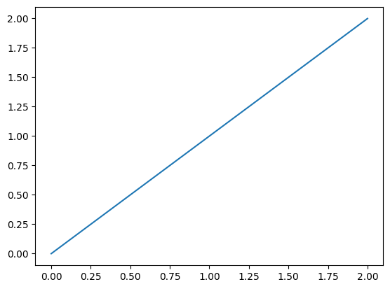

```python
for i in range(10):
    print(i)
```

    0
    1
    2
    3
    4
    5
    6
    7
    8
    9
    


```python
sadf=1
```


```python
import matplotlib.pyplot as plt
```


```python
plt.plot(range(3), range(3))
```


    [<matplotlib.lines.Line2D at 0x2a5fdcab390>]


    

    


```python

```
